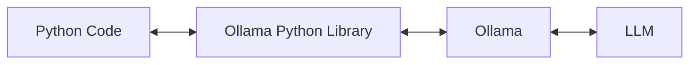

# AutoDocs

## Modifying mkdocs.yml

``` python
import yaml

class MyDumper(yaml.Dumper):
    def increase_indent(self, flow=False, indentless=False):
        return super(MyDumper, self).increase_indent(flow, False)

# Create a list of filenames
new_pages = []
for i in range(5):
    new_pages.append(f"lesson{i}.md")

# Read mkdocs.yml
with open("mkdocs.yml", "r", encoding="utf-8") as f:
    config = yaml.safe_load(f)

print(config)

# Add filename list to nav
config["nav"] = new_pages

# Write mkdocs.yml
with open("mkdocs.yml", "w", encoding="utf-8") as f:
    yaml.dump(config, f, sort_keys=False, allow_unicode=True, Dumper=MyDumper)
```

## ollama

* [https://ollama.com/](https://ollama.com/)
* [https://github.com/ollama/ollama-python](https://github.com/ollama/ollama-python)



```bash
ollama pull llama3.2
```

```bash
pip install ollama
```

```python
from ollama import chat
from ollama import ChatResponse

response: ChatResponse = chat(model='gemma3', messages=[
  {
    'role': 'user',
    'content': 'Why is the sky blue?',
  },
])
print(response['message']['content'])
# or access fields directly from the response object
print(response.message.content)
```

## autodocs using LLM

```python
import os
import re
import yaml
import ollama

class MyDumper(yaml.Dumper):
    def increase_indent(self, flow=False, indentless=False):
        return super(MyDumper, self).increase_indent(flow, False)

# 
MAIN_TOPIC = "Python Tutorial"
TOPIC_NUMBER = 5
# MODEL_NAME = "gemma3:1b"
# MODEL_NAME = "llama3.2"
# MODEL_NAME = "deepseek-r1:1.5b"
MODEL_NAME = "phi3"

prompt = f"""Please design {TOPIC_NUMBER} subtopics for the main topic "{MAIN_TOPIC}".  
For each subtopic, write a complete tutorial in Markdown format (including title and sections).  
At the beginning of each subtopic, add <<<START>>> and at the end add <<<END>>>.  

Do not include any HTML tags inside the Markdown.  
Ensure that code blocks are separated from other content by one blank line.  

Here are 3 example subtopics for reference:  

<<<START>>>
# Subtopic 1

Content 1
<<<END>>>

<<<START>>>
# Subtopic 2

Content 2
<<<END>>>

<<<START>>>
# Subtopic 3

Content 3
<<<END>>>

And so on...  

Please make sure that <<<START>>> and <<<END>>> always come in pairs.  
"""

response = ollama.chat(
    model=MODEL_NAME,
    messages=[
        {"role": "user", "content": prompt}
    ]
)

output_text = response["message"]["content"]

with open("output.txt", "w", encoding="utf-8") as f:
    f.write(output_text)


# Check if docs exists
os.makedirs("docs", exist_ok=True)

# Extract content between START and END using re
# Find all START...END blocks
matches = re.findall(r'<<<START>>>(.*?)<<<END>>>', output_text, re.DOTALL)

new_pages = []

# Save files one by one
for i, content in enumerate(matches, start=1):
    filename = f"lesson{i}.md"
    new_pages.append(filename)
    with open(f"docs/{filename}", "w", encoding="utf-8") as f:
        f.write(content.strip())  # remove blanks
    print(f"{filename} saved!")

# Update mkdocs.yml
with open("mkdocs.yml", "r", encoding="utf-8") as f:
    config = yaml.safe_load(f)

config["nav"] = new_pages

with open("mkdocs.yml", "w", encoding="utf-8") as f:
    yaml.dump(config, f, sort_keys=False, allow_unicode=True, Dumper=MyDumper)

print("mkdocs.yml updated!")
```
